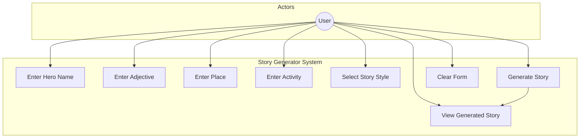
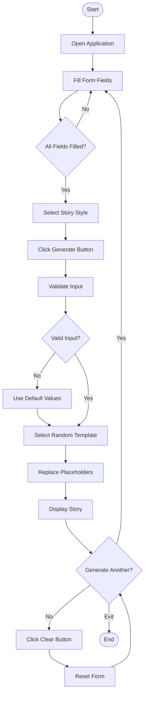
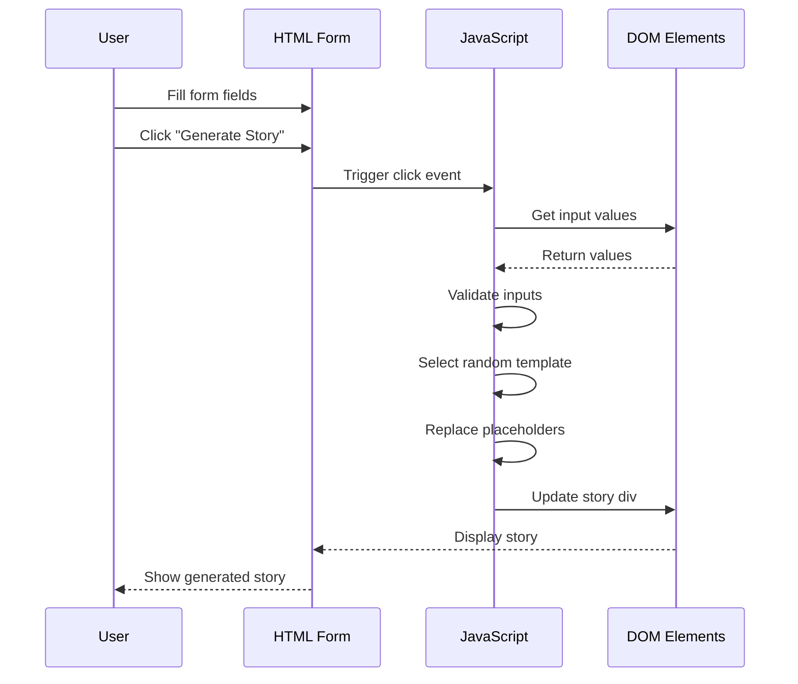
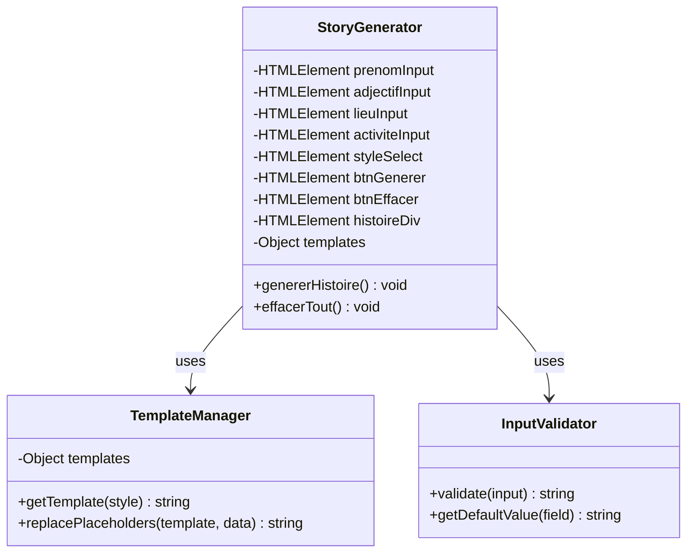
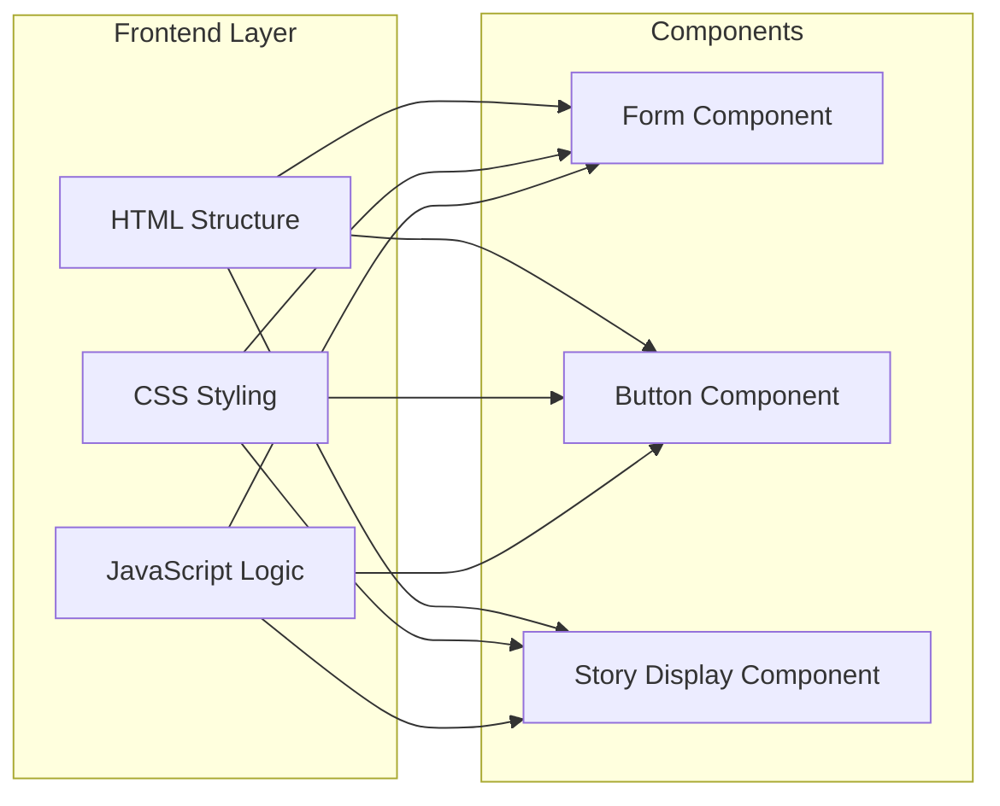

<div align="center">

# 📖 Interactive Story Generator


**A dynamic web application that generates personalized stories based on user input**

[Demo](#-demo) • [Features](#-features) • [Installation](#-installation) • [Usage](#-usage) • [Documentation](#-documentation)

---

</div>

## 📋 Table of Contents

- [Overview](#-overview)
- [Demo](#-demo)
- [Features](#-features)
- [Installation](#-installation)
- [Usage](#-usage)
- [Documentation](#-documentation)
  - [Project Structure](#-project-structure)
  - [UML Diagrams](#-uml-diagrams)
  - [Code Architecture](#-code-architecture)
- [Technical Details](#-technical-details)
- [Contributing](#-contributing)
- [License](#-license)
- [Author](#-author)

---

## 🎯 Overview

The **Interactive Story Generator** is a client-side web application that allows users to create unique, personalized stories by filling out a simple form. The application combines user-provided elements (hero name, adjective, place, activity) with pre-defined story templates to generate engaging narratives in three different styles: **Funny**, **Heroic**, and **Mysterious**.

### 🎓 Educational Objectives

This project demonstrates:
- ✅ DOM manipulation with vanilla JavaScript
- ✅ Event handling (click, keyboard)
- ✅ Dynamic content generation
- ✅ CSS styling and responsive design
- ✅ Form validation and user input processing
- ✅ Template-based text generation

---

## 🖼️ Demo

### Screenshot


### Live Demo

Open `index.html` in any modern web browser to try the application.

---

## ✨ Features

| Feature | Description |
|---------|-------------|
| 🎭 **Multiple Story Styles** | Choose between Funny, Heroic, or Mysterious story templates |
| 🎲 **Random Generation** | Each generation picks a random template for variety |
| ⌨️ **Keyboard Support** | Press Enter to quickly generate stories |
| 🎨 **Beautiful UI** | Modern, responsive design with gradient backgrounds |
| 📱 **Mobile Friendly** | Fully responsive layout for all screen sizes |
| ⚡ **Instant Results** | No page reload required |
| 🧹 **Clear Function** | Reset all fields with one click |
| ✨ **Smooth Animations** | Fade-in effects for story display |

---

## 🚀 Installation

### Prerequisites

- Any modern web browser (Chrome, Firefox, Safari, Edge)
- No server or additional dependencies required

### Steps

1. **Clone the repository**
   ```bash
   git clone https://github.com/Lagmouchyoussef/Interactive-Story-Generator.git
   ```

2. **Navigate to the project folder**
   ```bash
   cd Interactive-Story-Generator
   ```

3. **Open in browser**
   - Double-click `index.html`, or
   - Right-click and select "Open with" your preferred browser

---

## 📖 Usage

### Step-by-Step Guide

1. **Enter Hero Name** - Type the name of your story's main character
2. **Add an Adjective** - Describe your hero (e.g., brave, funny, mysterious)
3. **Specify a Place** - Where does the story take place?
4. **Define an Activity** - What action will the hero perform?
5. **Select Story Style** - Choose from the dropdown menu:
   - 🤡 **Funny** - Light-hearted, humorous tales
   - 🦸 **Heroic** - Epic adventures and brave deeds
   - 🔮 **Mysterious** - Enigmatic and suspenseful narratives
6. **Generate** - Click "Generate Story" or press Enter
7. **Enjoy** - Read your unique story!
8. **Reset** - Click "Clear" to start over

### Example Input

| Field | Example Value |
|-------|---------------|
| Hero Name | `Lina` |
| Adjective | `courageous` |
| Place | `in an ancient forest` |
| Activity | `discover a hidden treasure` |
| Style | `Heroic` |

### Example Output

> "In ancient times, Lina the courageous journeyed in an ancient forest to fulfill a sacred quest. Their challenge: to discover a hidden treasure. Despite the obstacles, our hero showed extraordinary courage and triumphed against all odds. Their name was forever etched in the annals of history."

---

## 📚 Documentation

### 📁 Project Structure

```
Interactive-Story-Generator/
│
├── 📄 index.html      # Main HTML structure and CSS styles
├── 📜 script.js       # JavaScript logic and story generation
├── 📷 screenshot.png  # Application screenshot
└── 📝 README.md       # Project documentation
```

### 📊 UML Diagrams

#### Use Case Diagram



#### Activity Diagram



#### Sequence Diagram



#### Class Diagram



#### Component Diagram



### 🏗️ Code Architecture

#### HTML Structure

```
├── app-container
│   ├── app-header
│   │   ├── h1 (Title)
│   │   └── p (Subtitle)
│   ├── form-section
│   │   ├── form-grid
│   │   │   ├── form-group (Hero Name)
│   │   │   ├── form-group (Adjective)
│   │   │   ├── form-group (Place)
│   │   │   ├── form-group (Activity)
│   │   │   └── form-group (Style)
│   │   └── buttons-row
│   │       ├── btn-primary (Generate)
│   │       └── btn-secondary (Clear)
│   └── story-section
│       ├── story-title
│       └── story-box (Output)
```

#### JavaScript Flow

```
┌─────────────────────────────────────────────────────────────┐
│                    INITIALIZATION                           │
│  1. Get DOM elements by ID                                   │
│  2. Define story templates object                           │
│  3. Add event listeners                                     │
└─────────────────────────────────────────────────────────────┘
                            │
                            ▼
┌─────────────────────────────────────────────────────────────┐
│                    USER INTERACTION                         │
│  User clicks "Generate Story" or presses Enter              │
└─────────────────────────────────────────────────────────────┘
                            │
                            ▼
┌─────────────────────────────────────────────────────────────┐
│                    DATA COLLECTION                          │
│  1. Get values from all input fields                        │
│  2. Apply default values if empty                           │
│  3. Get selected story style                                │
└─────────────────────────────────────────────────────────────┘
                            │
                            ▼
┌─────────────────────────────────────────────────────────────┐
│                    STORY GENERATION                         │
│  1. Select random template based on style                   │
│  2. Replace placeholders with user values                   │
│  3. Apply fade-in animation                                 │
└─────────────────────────────────────────────────────────────┘
                            │
                            ▼
┌─────────────────────────────────────────────────────────────┐
│                    OUTPUT DISPLAY                           │
│  1. Update story div content                                │
│  2. Remove "empty" class                                    │
│  3. Trigger CSS animation                                   │
└─────────────────────────────────────────────────────────────┘
```

---

## 🔧 Technical Details

### Technologies Used

| Technology | Purpose |
|------------|---------|
| HTML5 | Structure and semantic markup |
| CSS3 | Styling, gradients, animations, responsive design |
| JavaScript ES6+ | DOM manipulation, event handling, template processing |

### Key JavaScript Functions

| Function | Description |
|----------|-------------|
| `genererHistoire()` | Main function to generate and display the story |
| `effacerTout()` | Resets all form fields and clears the story |
| Event Listeners | Handle button clicks and keyboard input |

### CSS Features

- **Flexbox** and **CSS Grid** for layout
- **CSS Variables** for consistent theming
- **Gradient backgrounds** for visual appeal
- **CSS Transitions** for smooth interactions
- **Media Queries** for responsive design
- **Pseudo-elements** for decorative quotes

### Browser Compatibility

| Browser | Version | Status |
|---------|---------|--------|
| Chrome | 80+ | ✅ Fully Supported |
| Firefox | 75+ | ✅ Fully Supported |
| Safari | 13+ | ✅ Fully Supported |
| Edge | 80+ | ✅ Fully Supported |

---

## 🤝 Contributing

Contributions are welcome! Here's how you can help:

1. **Fork** the repository
2. **Create** a feature branch (`git checkout -b feature/AmazingFeature`)
3. **Commit** your changes (`git commit -m 'Add some AmazingFeature'`)
4. **Push** to the branch (`git push origin feature/AmazingFeature`)
5. **Open** a Pull Request

### Ideas for Contributions

- [ ] Add more story templates
- [ ] Implement story saving to localStorage
- [ ] Add character limit counter
- [ ] Create dark mode theme
- [ ] Add multi-language support
- [ ] Implement story sharing feature

---

## 📄 License

This project is open source and available under the [MIT License](LICENSE).

---

## 👤 Author

<div align="center">

**Youssef Lagmouch**

[](https://github.com/Lagmouchyoussef)

</div>

---

<div align="center">

### ⭐ If you found this project useful, please consider giving it a star! ⭐

**Made with ❤️ and JavaScript**

</div>
